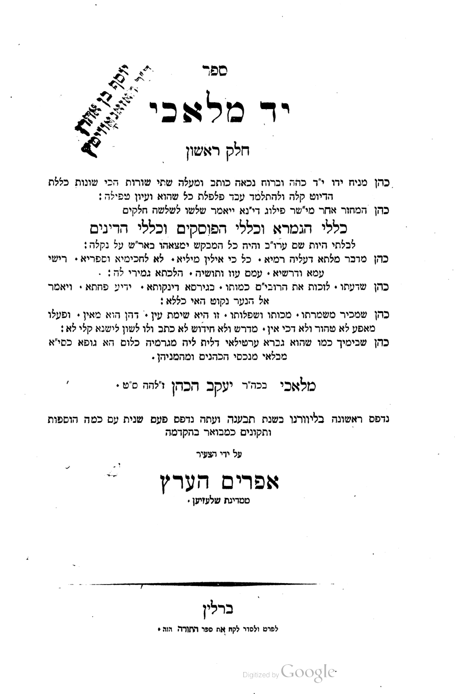
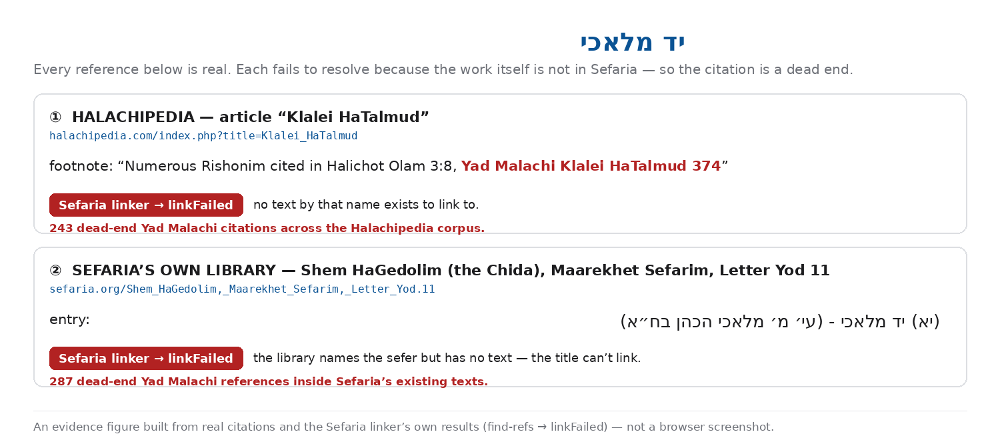
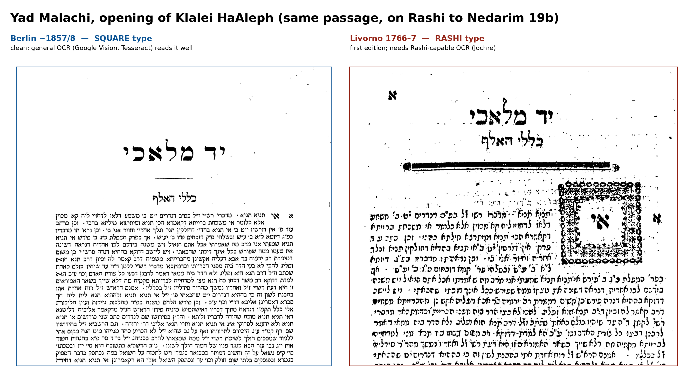
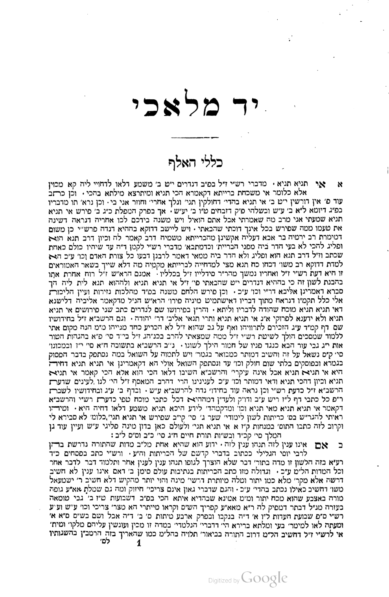

# A case for digitizing Yad Malachi

_A proposal to scan, OCR, and structure one foundational, public-domain work of
Torah that is heavily relied upon but not yet available as clean digital text._

> **Bottom line.** *Yad Malachi* is the **#1 public-domain work Sefaria lacks** — it
> is cited **287 times inside Sefaria's own corpus** (every one a dead-end link) and
> **243 times** in contemporary halachic writing. It is fully public domain, and
> **four print editions in five scans are already in hand** (three in clean square
> type). The plan: OCR the square editions, structure them into the work's native
> three-part / *klalim* schema, and ingest — turning 287 dead references into live
> links. **Cost:** a lean single-edition path is a few hundred dollars; the full
> multi-witness ensemble adds a one-time, reusable engineering harness.
> **First step:** a proofed *Klalei HaGemara* Aleph-section pilot.

## The work

**Yad Malachi** (יד מלאכי), by **R. Malachi ben Jacob HaKohen of Livorno**
(d. 1772), first printed Livorno 1766–7 (later Berlin ~1857/8). It is a three-part
masterwork of *methodology* — the rules by which the Talmud is learned and halacha
is decided:

1. **Klalei HaGemara** — an alphabetical index of the rules and technical terms of
   the Talmud, with explanations.
2. **Klalei HaPoskim** — the rules governing the codifiers (Rif, Rambam, Rosh, Tur,
   Shulchan Aruch…).
3. **Klalei HaDinim** — the principles of halachic decision-making and responsa.

It is, in short, the *grammar* of the tradition: not a text read once, but a
reference reached for whenever a question of method arises.

_Title page of the Berlin edition — naming the three parts (כללי הגמרא, כללי הפוסקים,
כללי הדינים) and the author, R. Malachi ben Jacob HaKohen._

## Why it matters

Its standing is not a matter of opinion — and it is not a historical curiosity. The
Chida praised Yad Malachi effusively, and it was "quoted frequently by major halakhic
authorities of the 18th and 19th centuries."[^wiki]

**Across the centuries.** That reliance is measurable inside the digital library
today: **287 places in Sefaria's existing texts cite יד מלאכי**[^sefaria] — and every
one is a **dead end**, because the work itself is not in the library. A reader who
reaches "Yad Malachi, Klal …" inside a work Sefaria *does* have cannot follow the
reference. Two things stand out in who is citing it:

| Mentions | Citing work |
|---:|---|
| 118 | Ayin Zokher (Chida) |
| 17 | Petach Einayim (Chida) |
| 13 | Shem HaGedolim (Chida) |
| 8 | Rosh David (Chida) |
| 11 | Pardes Yosef |
| 9 | Kaf HaChayim (d. 1939) |
| — | + Mishnah Berurah / Biur Halacha, Torah Temimah, Minchat Chinukh, Even Ha'azel, and living responsa (Benei Banim) |

First, **the Chida leans on it enormously** — four of his works account for **~156 of
the 287 citations** (Ayin Zokher, Petach Einayim, Shem HaGedolim, Rosh David). That is
not a weakness in the argument, it is the argument: the **Chida — the towering Sephardi
authority of the era and the author's own contemporary — treats Yad Malachi as a
standing reference**, reaching for it more than 150 times. Second, the reliance does
**not** stop with him: the remaining ~130 citations **span the next two centuries** —
Pardes Yosef, Kaf HaChaim (d. 1939), Mishnah Berurah / Biur Halacha, Torah Temimah,
Minchat Chinukh, Even Ha'azel, and living responsa (Benei Banim). One giant leans on it
constantly, and a long tail of later authorities keeps citing it.

**And in active use today.** Yad Malachi is a living reference, not a shelved
classic:

- It is **continuously republished**: again in the late 20th century, a new Israeli
  edition in 2001, a **Machon Yerushalayim critical edition in 2016** (freshly
  typeset, cross-referencing parallel *Klalim* works), and a third volume in
  2018.[^wiki] A work the contemporary Torah-publishing world keeps re-typesetting
  is a work in active use — and it draws **modern academic scholarship** that treats it
  as a classic of its genre: a peer-reviewed study by an independent (non-halachic)
  linguist calls Yad Malachi *"one of the most important halakhic rule books"* and
  *"one of the classic books of rules … known for its clear and organized writing
  style,"* choosing it as the representative text through which to analyze how halacha
  decides between opinions.[^brown]
- **It is still the anchor of live halachic debate.** Take one rule — that where the
  Shulchan Aruch brings two anonymous opinions (*yesh … ve-yesh …*) the halacha follows
  the latter. A present-day Torah forum thread devoted to exactly that question **opens
  with Yad Malachi as its lead authority** — *"the words of R. Malachi HaKohen, author
  of Yad Malachi"* — then builds outward to later poskim (Edut BiYehosef of R. Yosef
  Samun, R. Shmuel ibn Elbaz, R. Avraham Pinto), while another participant ties the rule
  to the Mishnah Berurah. And it is not one thread: a phrase search of that **single
  forum** returns Yad Malachi cited in **~108 posts across ~71 distinct discussions** —
  50 of them citing a specific *klal* (Klal 541, Klal 144, Klalei HaRambam §4, …) — of
  which **six are outright requests for a *scan* of a particular klal**, because no
  clean digital text exists to copy from.[^forum] Primary text, academic scholarship,
  and everyday learning all converge on the same *klalim* — every pointer landing on a
  Yad Malachi that is not in the library. Those six scan-requests are the re-keying this
  project would end, caught in the wild.
- In a large **contemporary English-language halachic reference** (Halachipedia),
  Yad Malachi is cited **243 times** — directly, by its numbered klalim.[^halachipedia]
  That makes it the **single most-cited public-domain work that Sefaria
  lacks**[^mostwanted] — present-day halachic writing reaching for it, hundreds of
  times, right now.
- Modern authorities cite it directly: Kaf HaChaim (d. 1939) and the contemporary
  responsa Benei Banim appear among the 287 above.
- **It sits at the center of the dominant modern psak school.** R. Ovadia Yosef's
  circle is the single largest body of works in this project's demand data — Yalkut
  Yosef, Yabia Omer, Chazon Ovadyah and the rest make up roughly **a third of every
  citation Sefaria is missing**. And R. Ovadia's method is built precisely on the
  *klalei ha-hora'ah* — the rules governing the Rif, Rambam, Rosh and the Mechaber —
  that Yad Malachi codifies.[^ovadia] That engagement is visible in the contemporary
  Sephardi reference literature: Halachipedia invokes Yad Malachi in the **same
  halachic discussions** as R. Ovadia's works — e.g. *Yad Malachi (Klalei Shulchan
  Aruch 11)* pointing to his **Taharat HaBayit**, and *Yad Malachi (Klalei Tosafot
  24)* cited alongside **Yabia Omer vol. 8**. A reader following a Yalkut Yosef or
  Yabia Omer ruling into its methodological basis lands on Yad Malachi — and today
  hits a dead end.

## The gap this closes

Yad Malachi is **public domain** — no rights, no license, no permission needed. Yet
there is no **free, structured, linkable** digital text of it. What exists is behind
paywalls or unstructured: **Otzar HaChochma** serves it as OCR-*searchable* page-images
(a subscription library, print-format scans — not clean linkable text), and the
**Machon Yerushalayim** critical edition is proprietary. None of these is on Sefaria,
and none is a free structured text that a reference can resolve to. So every one of
those 287 references is unlinkable, and anyone quoting the work must **hand-transcribe
the Hebrew** from a scan. Digitizing it once turns 287 dead references into live links
and ends the re-keying — permanently.

_The same dead end in real contexts: a Halachipedia footnote and the Chida's Shem
HaGedolim (already in Sefaria) both cite Yad Malachi, and the linker returns
`linkFailed` because the work has no text to point to. (An evidence figure from real
citations and the linker's own results — not a screenshot.)_

## Why it is an ideal candidate

- **Public domain** — free to reproduce.
- **Cleanly structured** — its native form (numbered *klalim* within three parts)
  maps directly onto a digital schema, so each reference becomes individually
  linkable.
- **Public-domain scans already exist** — no physical scanning needed; see the
  witnesses below.

### The witnesses in hand

Every scan below was inspected page-by-page and identified from its title page. They
resolve to **four distinct print editions across five independent scans** (the two
Przemyśl 1877 files are one printing scanned twice). These are **page-image scans**.
Some carry an embedded OCR text layer, but **that text is not good enough to use** — it
ranges from error-ridden to unusable (see the samples under *Process*), so the work is
to **OCR the page images properly**, not to reuse the text that happens to ship with
them:

| Edition | Press | Script | Scan in hand | Pages (scan) |
|---|---|---|---|---|
| **Livorno 1766–7** — *editio princeps*[^livorno] | (Livorno) | **Rashi** (body); square lemmas | HebrewBooks #32530 / #32532 / #32531 (3 part-files) | 348 / 54 / 55 |
| **Berlin ~1857/8**[^berlin] | Ephraim Herz | **Square** | Google Books | 337 |
| **Przemyśl 1877**[^p1877] | M. A. Knoller | **Square** | HebrewBooks #14122 | 491 |
| **Przemyśl 1877** (2nd scan)[^p1877] | " | **Square** | Google Books | 489 |
| **Przemyśl 1888**[^p1888] | Żupnik, Knoller & Hamerschmidt | **Square** | Google Books | 373 |

The three later editions each bind all three parts in one volume, and **all three
are set in clean square Hebrew type, not Rashi** — which is exactly what
general-purpose OCR reads best (see process). The same passage — the opening of
*Klalei HaAleph*, on Rashi to Nedarim 19b — in the Berlin (square) and Livorno
(Rashi) editions:

The Berlin edition's opening of *Klalei HaGemara* (the Aleph section) — the clean,
square-set page that would serve as the OCR base:

## Process — ensemble OCR with AI adjudication

High accuracy on dense rabbinic Hebrew comes not from proofreading one OCR pass but
from **consensus across many witnesses**. OCR engines make *uncorrelated* errors, so
where several agree the reading is near-certain, and disagreements are automatically
localized to specific words — turning "proofread everything" into "adjudicate the
few conflicts."

1. **Gather every public-domain witness.** Five scans of four editions are already in
   hand — the Livorno 1766–7 first edition (Rashi) and three square-set reprints
   (Berlin ~1857/8, Przemyśl 1877 in two scans, Przemyśl 1888); add any further early
   printings from Otzar if convenient. Each edition is an independent witness to the
   same PD text. (Modern critical editions are *not* scanned into the corpus — see the
   copyright note.) Two caveats on independence: the two Przemyśl printings share a
   press lineage (Żupnik/Knoller), so treat them as *near*-independent; the strongest
   independent pairing is **Berlin** (square) against the **Livorno** first edition
   (Rashi). The two scans of Przemyśl 1877 are the same *type* but differ in scan
   noise, so they still help the vote.
2. **OCR the page images — don't trust the embedded text.** Some of these PDFs ship an
   embedded OCR layer, but it is **not good enough to use as the base text**.
   [`data/ocr-samples/`](ocr-samples/) shows the same three passages (the
   Aleph/Bet/Gimel section openings) as the raw embedded OCR of all five scans: the
   Berlin scan comes out cleanest, yet even it carries errors, the (also square)
   Przemyśl Google scans are **badly letter-confused**, and the Rashi Livorno is
   **unusable**. Square type is *necessary but not sufficient*; scan-and-OCR quality is
   everything. So treat every witness as page images and run proper OCR over them:
   - **Square editions (Berlin, Przemyśl) — the base text.** Run **Google Cloud
     Vision / Document AI** and **Tesseract `heb`** (both strong on square Hebrew,
     both weak on Rashi — which is why the square editions carry the load) over the
     page images. Several engines × several square editions give many independent
     passes to align and vote on.
   - **Livorno first edition (Rashi) — collation witness.** General engines fail on
     Rashi, so read it with a Rashi-capable tool: **Jochre 3** (open-source, trained
     for rabbinic/Rashi type) or a **Kraken/eScriptorium** model trained on this
     typeface. It contributes variant readings, not the base.
   - **Rabbinic-Hebrew post-correction on every pass.** Run outputs through
     **Dicta**[^dicta] — a free Israeli non-profit built specifically for rabbinic
     Hebrew: its OCR/**Maivin** tools expand abbreviations, restore
     punctuation, and its rabbinic language model (**BEREL**) fixes context-obvious
     OCR errors (e.g. a wrong letter inside a known talmudic phrase). Dicta is
     web-based, so it runs on macOS in a browser; I found **no dedicated Mac desktop
     app built on Dicta** — the closest "built-for-this" option is Dicta's own tools,
     with **ABBYY FineReader** (desktop Mac/Windows, good general square OCR, no
     rabbinic specialization) and **Transkribus** (trainable HTR platform) as
     alternatives. Uncorrelated errors across these engines *and* editions make
     agreement a strong signal.
3. **Align and vote — per scan.** Align the engine outputs (word/character sequence
   alignment, anchored on the numbered *klalim*) and take a per-token consensus.
   Agreed tokens — the large majority — are accepted automatically; only conflicts
   are flagged.
4. **AI adjudication — image-grounded, selection-only.** For each flagged token,
   give a multimodal model (Claude / GPT with vision) the candidate readings **plus
   the cropped scan image** of that word, and have it *select* the correct reading —
   never invent text. It must name the witness it relied on; anything not attested
   by a scan is a flagged conjecture for a human, not a silent change. This is the
   critical guardrail against the model "helpfully" emending the text to what it
   expects.
5. **Collate the editions.** With each printing reduced to a best-text, collate them
   against each other. Genuine differences between printings (a typo or correction in
   one) are recorded as variants — yielding a text potentially *more accurate than
   any single historic printing*, with an apparatus. (This is a corrected reading of
   the PD printings against each other — not a critical edition; the modern Machon
   Yerushalayim edition is the scholarly critical text, and this does not aim to
   supersede it.)
6. **Expert review — only the flagged set.** A **domain expert — a Torah scholar
   (Talmid Chacham) fluent in this genre**, not merely a Hebrew reader — resolves the
   remaining conflicts against the scan (and may **consult** the modern critical
   editions as a reference for hard readings — see note) and spot-checks the
   auto-accepted text. The genre matters: dense abbreviations, talmudic shorthand, and
   the *klalim*-cross-references are ambiguous to a non-specialist, so the reviewer's
   fluency is what makes the flagged readings resolvable. Because they only ever touch
   disagreements, this is a fraction of full proofreading.
7. **Structure and ingest** into the three parts and their klalim; output text +
   per-token confidence map + variant apparatus.

**Copyright note.** The *base text you reproduce* comes only from fully
public-domain printings. You may **consult** modern critical editions (2001; Machon
Yerushalayim 2016) to decide a hard reading — using a work to inform judgment is not
infringement — but you may not reproduce their annotations, cross-references, or
apparatus, or OCR them into the corpus; source the actual reading from a PD printing.
(General principle, not legal advice; have counsel bless the workflow before
publication.)

## Cost

The ensemble front-loads a little engineering and collapses the human cost — which
is the expensive part of any digitization.

The work runs **~340–460 pages** (the square editions bind all three parts in ~340
pages; the Livorno set is 348 + 54 + 55), OCR'd across the five scans as above.

- **One-time harness** (OCR-ensemble + alignment + adjudication): developer time,
  ~40–80 hrs, and **reusable** for every other public-domain work — so it amortizes
  far beyond this one text. This is the real cost of the *first* work; every work
  after reuses it.
- **Compute** (multi-engine OCR of the page images + AI adjudication over the
  editions): modest — low hundreds of dollars in OCR/API credits at most.
- **Expert review** — only the flagged conflict set, and by a Torah scholar (Talmid
  Chacham), not a general proofreader. If the ensemble auto-accepts ~90% of tokens,
  the reviewer handles the rest in perhaps **~5–10 hours (~$150–350)**, versus ~25–45
  hours to proofread all 457 pages single-pass.

Net: the **first** work costs the one-time harness (~40–80 hrs of engineering) plus a
few hundred dollars of compute and expert review; **each work after it** is just the
few hundred dollars, because the harness is reused. The output is *more* accurate than
a single proofread pass — potentially better than any of the historic printings. For
that, a foundational work of Torah — cited 287 times inside the very library that
currently lacks it, and 243 times in contemporary halachic writing — goes permanently
online. (The leaner single-witness path in *Preparing the text for Sefaria* is cheaper
still, skipping the harness entirely.)

_Cost figures are estimates; page counts are from the source catalogs and from the
scan page-counts. Every scan was inspected page-by-page; edition identifications are
from the title pages transcribed in the footnotes below._

## Preparing the text for Sefaria

Getting the text *into* the library is a distinct last mile with its own rules, and it
keeps two things separate: **the text version** (what you transcribe) and **the links**
(how it connects to everything else).

**OCR the best edition's images — the embedded text is not usable.** All three later
Google Books scans were digitized from **National Library of Israel** copies; some ship
an embedded OCR layer, but none is clean enough to submit — the Berlin layer is the best
of them and still carries errors, while the two Przemyśl layers are badly letter-confused
(see [`data/ocr-samples/`](ocr-samples/)). So treat every scan as **page images** and
OCR them. Build from the **Berlin ~1857/8** edition: it is the cleanest square
typesetting, so it OCRs best — giving a strong base text to proof and structure rather
than key from scratch.

**Licensing is clear.**[^ocrpd] The Berlin edition (~1857) is public domain, and a
faithful mechanical OCR of a public-domain text adds no new authorship of its own — so
the text is free to place under Sefaria's CC0 / public-domain terms. The only wrinkle
is contractual, not copyright: files pulled from Google Books carry Google's usage
terms (attribution, non-commercial, no bulk scraping). The clean way around it — since
the scans are **NLI** holdings — is to source the page images from NLI directly where
possible and **OCR them yourself**, which also sidesteps Google's terms entirely, then
attribute the edition (Berlin 1857) and scan provenance. The resulting text stands on
the PD edition regardless of who OCR'd it.

**Keep the prose faithful — "minimal changes" is the right instinct, but not "no
changes."** A Sefaria version represents a specific printing, so:

- **Don't** expand the abbreviations or rewrite the prose — leave רש״י, פ״ב, סי׳ as
  printed. (Abbreviation *expansion* is a read-time layer — Dicta/Maivin — not a change
  to the submitted text; if a word ever must be added, mark it in `[brackets]` or a
  footnote.)
- **Do** still: (1) **proof against the image** — even good OCR has residual
  errors; (2) **strip non-text cruft** — running headers, page numbers, the NLI and
  "Digitized by Google" stamps, blank plates; (3) **restore reading order** where the
  OCR interleaved a two-column page; and (4) **segment into the schema** — the three
  parts → their klalim → one segment per klal, so every reference gets a stable address
  like *Yad Malachi, Klalei HaGemara, Aleph 1*.

**Links are a separate layer — don't hand-insert them.**[^linker] Sefaria stores
connections apart from the text, and its **Auto-Linker** builds them by detecting
citations. Your job in the text is only to make citations *parseable*: the linker
wants the **title written out** followed by the numeric reference, ordinary
punctuation, and no dash inside a single ref (a dash denotes a range). So the useful
"normalization" here is **not** expanding the prose's abbreviations — it is normalizing
the **citation references** (Rashi, Tur, Shulchan Aruch, the sister klalim) into
linker-friendly form so they auto-resolve; the residue can be added as manual links.
This is exactly the normalization problem this repository works on. And the payoff runs
both ways: the **287 existing references *to* Yad Malachi** light up automatically the
moment the work exists under a canonical ref — with no edits to those 287 works at all.
One design dependency to get right: the schema's addressing (e.g.
*Klalei HaGemara, [letter], [klal]* vs. a running klal number) should be **chosen to
match how those 287 sources actually cite it**, or the inbound links won't resolve on
their own — so sample the existing citation style before fixing the scheme.

**Add a link-readiness QA step — test for auto-linking, don't apply the links.** Before
ingest, run the finished text through Sefaria's linker (`/api/find-refs`) purely as a
*test*. It returns each detected citation with a `linkFailed` flag, so the output is
two lists: citations that resolve as-is (nothing to do — Sefaria will link them at
ingest), and citations it **detects but cannot link**. Each failure is then flagged
with a **candidate normalized citation**, itself re-tested against the linker so the
suggestion is verified as *linkable* before a human ever sees it. The text is **never
modified** by this step — it produces a flagged worklist for the expert reviewer, who
confirms the candidate is not just linkable but *correct*. A worked example on a real
Klalei HaAleph passage is in [`data/link-readiness-demo.md`](link-readiness-demo.md)
(run by [`pipeline/link_readiness.py`](../pipeline/link_readiness.py)): of the seven
spans the linker flagged, the one clean daf reference (`נדרים י"ט ב'`) auto-linked, and
the six abbreviated/chapter-style references (`רש"י ז"ל בפ"ב דנדרים`, `בפרק המפלת כ"ג
ב'`, …) failed — five getting a verified candidate (Rashi on Nedarim 19b, Niddah 23b,
Yoma 31b, …) and one being a linker mis-segmentation left for manual review. That is the normalization payoff made concrete: the linker measures
link-readiness, and this repo's normalizer supplies the fix.

**Two paths, right-sized.** The *lean* path — OCR just the Berlin edition (its cleanest
square images), proofed against the other scans where in doubt, structured and
citation-normalized — gets a solid, honestly-labeled version into the library quickly
(and Sefaria is a wiki: it can be refined later). The *full ensemble* above is the higher-accuracy upgrade, worth it for
a foundational reference and reusable for the next work. Either way, the base text
stays faithful to a public-domain printing.

## The ask

Digitize Yad Malachi and place it in Sefaria — the top freely-digitizable work its
library is missing. Concretely:

1. **Pilot first.** Produce one proofed, structured section — *Klalei HaGemara*, the
   Aleph section — OCR'd from the Berlin edition images, run it through the
   link-readiness check, and confirm the schema and citation-linking end to end. Small, cheap, and it
   de-risks everything downstream.
2. **Then the full work.** Complete the three parts on the chosen path (lean or
   ensemble), attaching each historic printing as its own version.
3. **Coordinate ingest** with Sefaria (**hello@sefaria.org**), offering the
   expert-review quality certification and the per-printing variant apparatus.

The result is permanent: 287 dead references become live links, the re-keying ends,
and the reusable harness lowers the cost of every public-domain work after this one.

## Notes

[^wiki]: English Wikipedia, "Malachi ben Jacob ha-Kohen" — three-part structure;
    author's death in 1772; his standing among later authorities and the Chida's
    praise; and the republication history (2001; Machon Yerushalayim critical
    edition 2016; third volume 2018).

[^sefaria]: Sefaria search API (`search-wrapper`, `type: text`), querying the corpus
    for citations of יד מלאכי: **287** in-corpus references, and the per-work
    breakdown in the table (Ayin Zokher 118, Petach Einayim 17, Shem HaGedolim 13,
    Pardes Yosef 11, Kaf HaChayim 9, Rosh David 8, and the further works listed).

[^halachipedia]: This project's citation survey of Halachipedia (a large contemporary
    English-language halachic reference): **243** direct citations of Yad Malachi by
    its numbered klalim, in the full 640-page corpus (`data/CORPUS-COMPARISON.md`).

[^brown]: Benjamin Brown (Hebrew University of Jerusalem), *"'Some say this, some say
    that': Pragmatics and discourse markers in Yad Malachi's interpretation rules,"*
    **JLL 3 (2014): 1–19**, DOI 10.14762/jll.2014.001. An independent, non-halachic
    (linguistics) study that calls Yad Malachi "one of the most important halakhic rule
    books" and "one of the classic books of rules … known for its clear and organized
    writing style," and takes it as the representative text for analyzing how halacha
    decides between opinions. It also fixes the bibliography: R. Malachi HaCohen
    Montefoscoli (1695–1772) of Livorno, *Yad Malachi*, 3 vols., Livorno: Moshe Attias
    Press, 1766–1767.

[^forum]: tora-forum.co.il, thread *"האומנם הכלל הוא שב'יש ויש' שבשולחן ערוך ההלכה כיש
    בתרא?"* ("is the rule really that a *yesh … ve-yesh* in the Shulchan Aruch follows
    the latter opinion?"). The opening post anchors on Yad Malachi — attaching its
    Klalei HaPoskim page — and brings Edut BiYehosef (R. Yosef Samun), R. Shmuel ibn
    Elbaz, and R. Avraham Pinto; a reply cites the Mishnah Berurah (Hilchot Shabbat and
    Eruvin). A contemporary lay/lamdanut forum, cited here as evidence of live usage,
    not as a halakhic authority; read by reference per the site's robots policy. The
    forum-wide figures are from an exact-phrase search of tora-forum.co.il for *"יד
    מלאכי"* (108 posts / 71 threads; 50 citing a specific klal; 6 requesting a scan) —
    counts only; no forum text is reproduced here, per the site's `ai-train=no` signal.
    Phrase-search figures may include the occasional non-sefer occurrence of the words
    *יד מלאכי*; sampled results were all genuine citations of the work.

[^ovadia]: R. Ovadia Yosef's methodology is documented as systematically applying the
    *klalei ha-hora'ah* — the rules of pesak governing the Rif/Rambam/Rosh and the
    Mechaber (e.g. webyeshiva.org, "Rabbi Ovadia Yosef's Halakhic Methodology";
    Nishmat; R. Chaim Jachter, Kol Torah) — which is Yad Malachi's exact domain. The
    demand figures are this project's Halachipedia analysis (`CORPUS-COMPARISON.md`);
    the same-footnote co-citations (Yad Malachi with Taharat HaBayit and Yabia Omer)
    are from the Halachipedia corpus (`pipeline/hp_cache`). **Caveat:** a direct
    citation count from *within* R. Ovadia's own works could not be machine-verified —
    they are not in a free, searchable digital corpus — so this is a qualitative
    observation grounded in his documented method and in contemporary co-citation, not
    a counted statistic.

[^linker]: Sefaria "How to Format Citations for the Linker" and the "Sefaria
    Auto-Linker" (developers.sefaria.org; Sefaria-Project wiki): links are stored as a
    separate connections layer and generated by detecting citations written as *title
    (spelled out) + numeric reference*; space/comma/period/colon are fine and a dash
    denotes a range. Footnote markup within a version is
    `n<i class="footnote">…</i>`.

[^ocrpd]: A faithful mechanical OCR of a public-domain text adds no original authorship
    and so attracts no new copyright of its own (cf. the originality requirement in
    *Feist v. Rural*, 1991); Google Books' usage terms are a contractual/attribution
    condition on the *files*, separate from copyright in the *text*. General principle,
    not legal advice — have counsel confirm before publication.

[^mostwanted]: Per this project's citation analysis of the full 640-page Halachipedia
    corpus (`data/SEFARIA-MOST-WANTED.md`, `data/CORPUS-COMPARISON.md`): among the
    works Sefaria does **not** have, Yad Malachi (243 citations) ranks **#6 overall
    and #1 of the public-domain tier** — the next public-domain work, Birkei Yosef,
    trails at 129. The five works ahead of it overall are all modern, in-copyright
    works (Yalkut Yosef, Chazon Ovadyah, Igrot Moshe, Shemirat Shabbat KeHilchata,
    Yabia Omer) that cannot be freely digitized; Yad Malachi is the top work that can.

[^livorno]: **Livorno 1766–7, first edition** (HebrewBooks #32530 / #32532 / #32531).
    Title page: *ספר יד מלאכי*, by *מלאכי בכמ"ר יעקב הכהן*; the three parts (Klalei
    HaGemara / HaPoskim / HaDinim). The *editio princeps*: body set in **Rashi
    script** with square keyword-lemmas; the roughest of the scans (ink bleed, skew).
    Digitized as three part-files (348 / 54 / 55 pp).

[^berlin]: **Berlin ~1857/8** (Google Books full-view scan). Title page: *ספר יד
    מלאכי חלק ראשון*, publisher *אפרים הערץ* (Ephraim Herz), *מדינת שלעזיען*, place
    *ברלין* (Berlin); notes it was "printed first in Livorno … and now a second time."
    The Przemyśl 1877 title page dates this Berlin printing to *התרי"ח* (5618 =
    1857/8). **Square** type, the cleanest scan. (The NLI copy carries the
    Hazanovitz-collection bookplate — a provenance stamp, not part of the edition.)

[^p1877]: **Przemyśl 1877** — present in two independent scans: HebrewBooks #14122 and
    a separate Google Books full-view scan. Title page: *ספר יד מלאכי חלק ראשון* …
    *מלאכי בכמ"ר יעקב הכהן*; colophon *פרעמישלא בשנת התרל"ז לב"ע* (5637 = 1877),
    publisher *משה אהרן קנעניל* (M. A. Knoller), printed by *ר' חיים אהרן זאפניק ען
    קנאללער* (Zupnik & Knoller); it names the prior Livorno (first) and Berlin
    (*התרי"ח*) printings. **Square** type. The two Przemyśl printings share this press
    lineage, so treat them as *near*-independent.

[^p1888]: **Przemyśl 1888** (Google Books full-view scan). Latin colophon: *JAD
    MALACHI, PRZEMYŚL, Drukiem Żupnika, Knollera i Hamerszmida, 1888*; Hebrew
    *פרעמישלא בשנת התרמ"ח לב"ע* (5648 = 1888). **Square** type.

[^dicta]: Dicta — analytical tools for Hebrew texts (dicta.org.il), a free Israeli
    non-profit; its Maivin tool vocalizes and punctuates rabbinic text, expands
    abbreviations, and identifies sources, and its BEREL model is a rabbinic-Hebrew
    language model. See also English Wikipedia, "Dicta (organization)."
